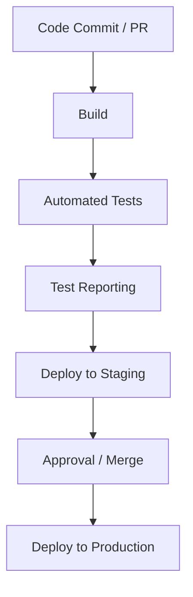

# CI/CD Workflow for Web & API Application (Playwright, Agile)

## Overview

This document outlines a **sample CI/CD workflow** for a modern web-based SaaS application with REST APIs, demonstrating how automated tests are integrated to ensure **high-quality releases**, **fast feedback**, and **risk mitigation**. The workflow aligns with **UK QA Engineer / SDET best practices**.

---

## Pipeline Stages

| Stage | Purpose | Sample Actions |
|-------|--------|----------------|
| **Code Commit / Pull Request** | Validate changes early | Linting, unit tests, critical smoke tests, static code analysis |
| **Build** | Prepare artifact for deployment | Frontend & backend build, packaging, dependency checks |
| **Automated Tests** | Verify functionality and regression | Run Playwright API tests and key UI flows, parallel execution where possible |
| **Test Reporting** | Provide visibility to stakeholders | Generate HTML/JSON reports, upload artifacts to pipeline dashboard |
| **Deploy to Staging** | Validate in a realistic environment | Optional smoke regression, API contract tests, integration checks |
| **Approval / Merge** | Ensure quality before production | Manual QA sign-off, code review, or automated gates |
| **Deploy to Production** | Final release | CI/CD triggers deployment with optional post-deployment smoke tests |

---

## Test Execution Details

### Pull Request Validation (Fast Feedback)
```bash
npx playwright test --grep @smoke
```

### Nightly Full Regression Suite
```bash
npx playwright test --reporter=html
```

### CI/CD Headless Execution
```bash
npx playwright test --headless --parallel
```

> Automated tests are integrated at multiple points to **catch defects early**, maintain stability, and provide rapid feedback to developers.

---

## Tools & Technologies

- **CI/CD Platforms:** GitHub Actions, GitLab CI, Jenkins (conceptual)
- **Test Framework:** Playwright (UI & API)
- **Language/Runtime:** JavaScript / TypeScript, Node.js
- **Reporting & Notifications:** HTML reports, optional Slack/email alerts

---

## Workflow Diagram



*This diagram represents the flow from code changes to production deployment, highlighting automated test integration points.*

---

## Best Practices

- Run **critical tests on every PR** to catch issues early.
- Execute full regression suites **nightly** or before release.
- Keep automated tests **stable, maintainable, and fast** to avoid pipeline flakiness.
- Monitor **metrics**: test coverage, defect detection rate, regression execution time.
- Maintain clear **reporting** and **communication channels** for cross-functional teams.


